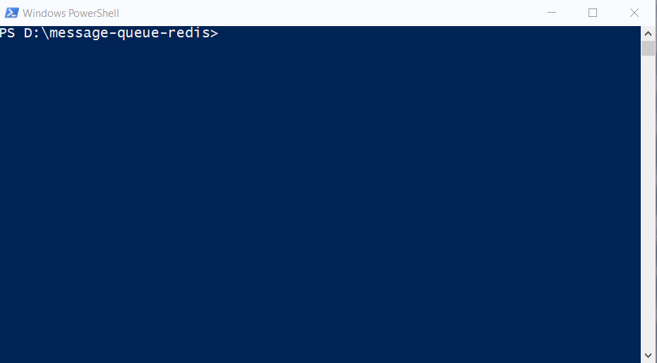
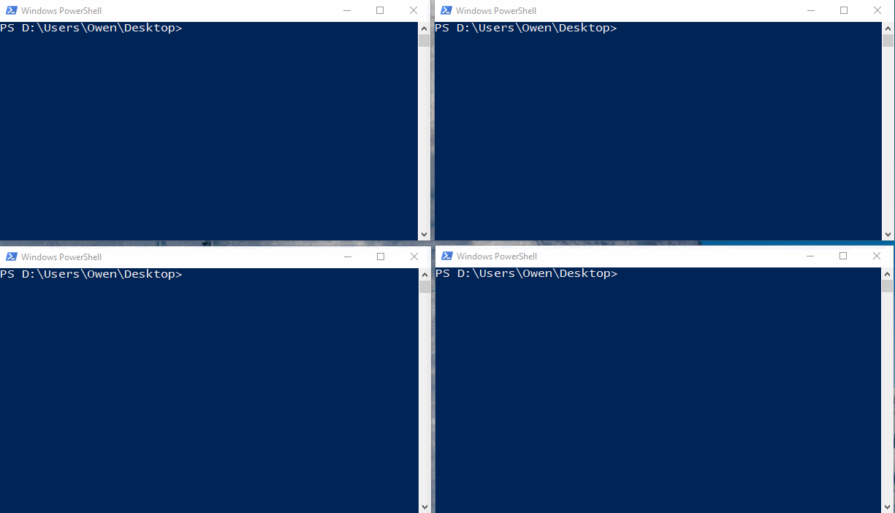
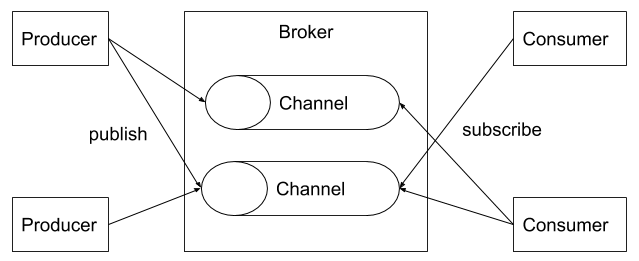

# Message Queue - Redis

As a sample for practicing Message Queue with Redis

## Demo




## Feature

- launch broker as media
- subscribe to channel
- publish message to channel

## Architecture


## Launch borker in Docker
```
docker-compose up
```

## Open publisher and consumer
```
docker exec -it mq.broker redis-cli
```
```
subscribe <channel>
```
```
publish <channel> message
```

## Demo Script
```
subscribe naruto
```
```
subscribe kuroko naruto
```
```
publish naruto sasuke
```
```
publish kuroku kagami
```
```
publish kuroku aomine
```